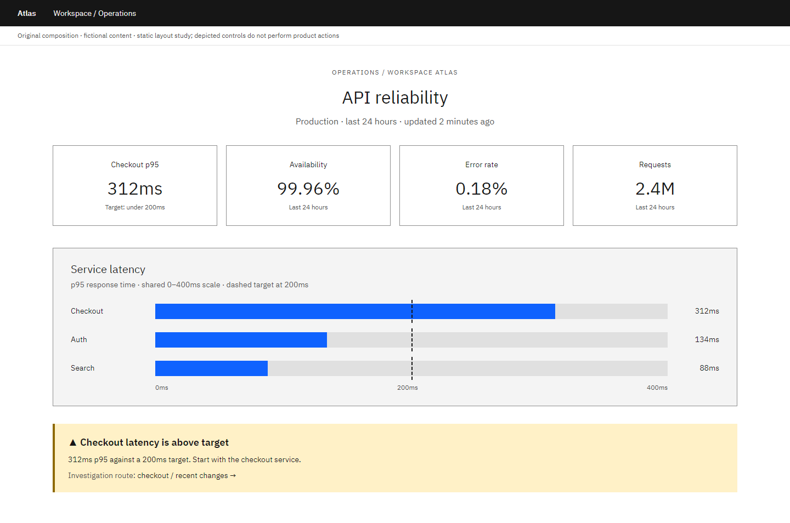
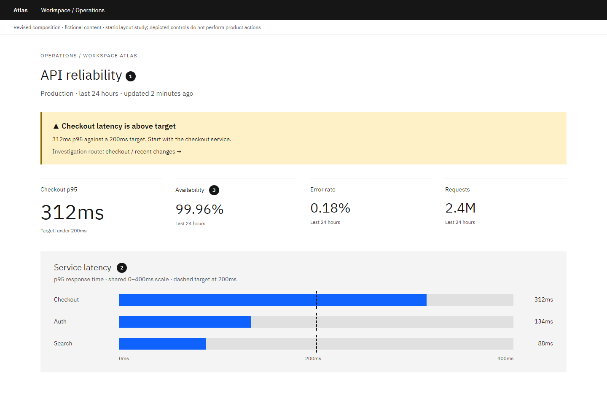

# Dashboard: Make the exception visible

Author-created static composition study with fictional content. Local craft judgment; not an official IBM exemplar or a model-evaluation result.

**Task:** An on-call engineer has five minutes to decide which service needs investigation.

**Original:** Four similar metric cards compete, while the latency exception is separated from the service comparison that explains it.

**Revised:** The active exception leads. Supporting metrics remain available, and one consistent scale makes the affected service identifiable.

## Decisions and conditions

### 1. Lead with the actionable exception

Checkout latency above the stated 200ms target is the reason to act. The issue summary connects the metric to an investigation rather than leaving the engineer to infer urgency.

**Tradeoff:** An exception-first page is less balanced as an executive overview.

**Alternative:** Use a neutral overview when the task is periodic reporting, with explicit drill-down to exceptions.

### 2. Make the encoding carry the comparison

The service bars share a zero baseline and a 400ms scale. Values and a labeled target make the comparison readable without relying on color.

**Tradeoff:** A single current value cannot explain a transient spike or trend.

**Alternative:** Use aligned time-series panels when the question is when degradation began; preserve comparable axes.

### 3. Keep supporting context available

Availability, errors and request volume remain readable but use smaller type and less enclosure. Space, type and alignment establish importance.

**Tradeoff:** A supporting metric may become primary during another incident.

**Alternative:** Let the task or active incident determine hierarchy; do not permanently equate visual size with business importance.

## Transfer exercise

Latency is healthy but the error rate rises sharply. Redesign the hierarchy without introducing a different visual grammar.

Compare a different task or constraint before applying these choices. The original versions deliberately expose composition problems; the revised versions are teaching proposals, not universally optimal designs.

Open the [viewer](../../assets/casebook/index.html) for both White and Gray 100, at 1440px and 390px. Screens use dashboard-before/after-white/g100-desktop/mobile.png. The mobile table intentionally scrolls within its own region.

## Source routes

- [IBM type scale](https://www.ibm.com/design/language/typography/type-scale/)
- [IBM layout](https://www.ibm.com/design/language/layout/overview/)

Sources inform general component, layout and type decisions. The task-specific comparisons and alternatives above are local heuristics. Static controls illustrate composition; they do not establish interaction, accessibility or Carbon React API correctness.
