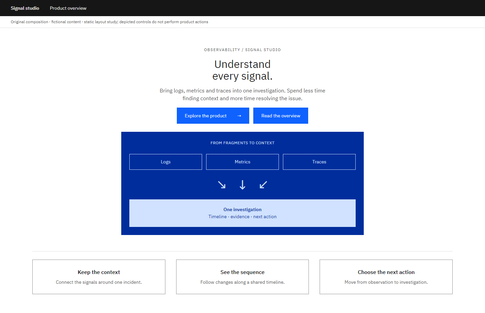
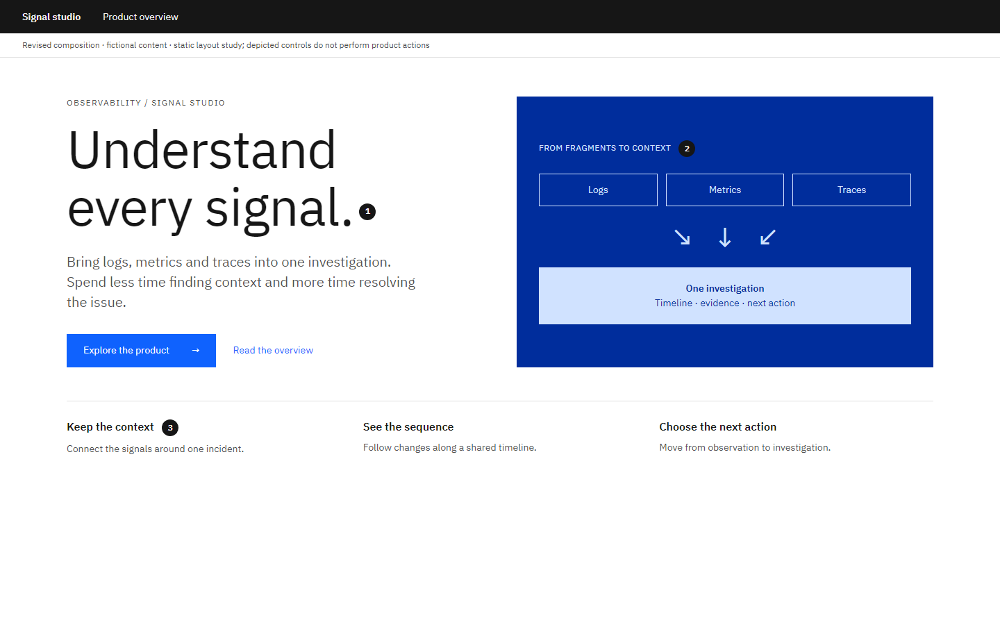

# Expressive page: Match the page to the moment

Author-created static composition study with fictional content. Local craft judgment; not an official IBM exemplar or a model-evaluation result.

**Task:** A first-time visitor needs to understand a fictional observability product and choose whether to explore it.

**Original:** Compact type, centered stacking and equal action emphasis make the introduction harder to distinguish from its supporting detail.

**Revised:** A larger, fluid headline and a concept diagram explain the offer, with a clear next action and a quieter route for more detail.

## Decisions and conditions

### 1. Give the main idea enough scale

The headline is the starting point for a visitor deciding whether this product is relevant. Larger type and a restrained text measure establish an expressive arrival region.

**Tradeoff:** A large headline gives fewer facts above the fold.

**Alternative:** Use a compact title in an established working tool, where repeated access and dense content matter more than introduction.

### 2. Use imagery to explain something

The original diagram shows logs, metrics and traces converging into one investigation. It reinforces the product idea without using decorative stock imagery or an IBM mark.

**Tradeoff:** The diagram simplifies the workflow and cannot replace documentation.

**Alternative:** Use a product screenshot when concrete capability is the deciding factor; use a domain image when human context matters more.

### 3. Carry the hierarchy into the next step

Explore the product is visually distinct from Read the overview. Supporting proof points sit below the introduction instead of competing with it.

**Tradeoff:** A single emphasized path may underserve visitors with a different intent.

**Alternative:** Two equally important audiences can justify an explicit audience choice before either call to action.

## Transfer exercise

Adapt this arrival region for a returning signed-in user. Keep the visual identity while prioritizing continuation of their work.

Compare a different task or constraint before applying these choices. The original versions deliberately expose composition problems; the revised versions are teaching proposals, not universally optimal designs.

Open the [viewer](../../assets/casebook/index.html) for both White and Gray 100, at 1440px and 390px. Screens use expressive-before/after-white/g100-desktop/mobile.png. The mobile table intentionally scrolls within its own region.

## Source routes

- [IBM type scale](https://www.ibm.com/design/language/typography/type-scale/)
- [IBM layout](https://www.ibm.com/design/language/layout/overview/)

Sources inform general component, layout and type decisions. The task-specific comparisons and alternatives above are local heuristics. Static controls illustrate composition; they do not establish interaction, accessibility or Carbon React API correctness.
