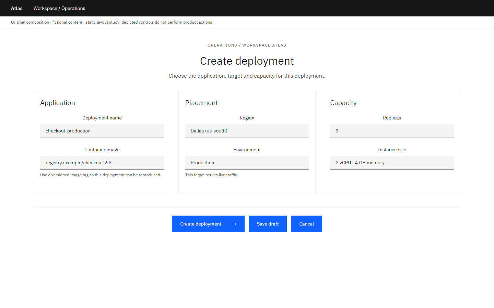
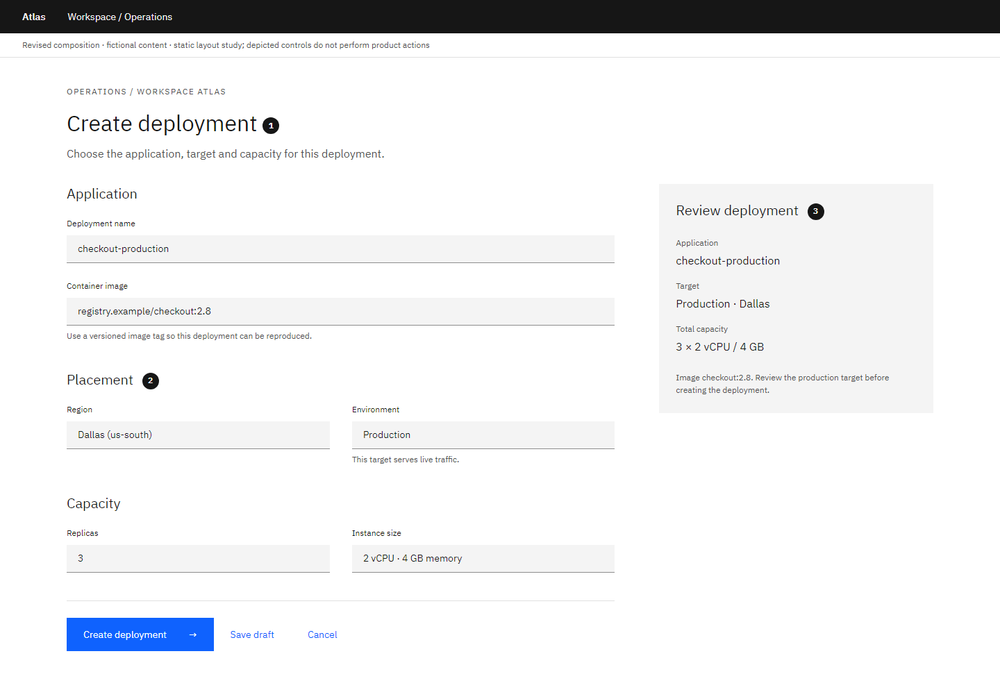

# Form: Give each decision a place

Author-created static composition study with fictional content. Local craft judgment; not an official IBM exemplar or a model-evaluation result.

**Task:** A developer must create a production deployment while understanding its target and capacity.

**Original:** A uniform multi-column grid gives naming, placement and capacity equal treatment and makes the reading order harder to predict.

**Revised:** A single main reading path groups related decisions; a compact review region keeps the consequence of the choice visible.

## Decisions and conditions

### 1. Group by the user's decision

Name and image establish what will run. Region and environment establish where. Replicas and capacity describe how much. The sequence follows those questions.

**Tradeoff:** A clearer sequence can make a short form taller.

**Alternative:** For a familiar repeated task, a compact two-column layout may work if labels, grouping and keyboard order remain predictable.

### 2. Keep help beside the choice it explains

Image and production guidance sits under the relevant value instead of in a detached notice. Label, value and explanation stay visually connected.

**Tradeoff:** Persistent helper text increases reading load when the instruction is already familiar.

**Alternative:** Reserve always-visible help for consequential choices; use disclosure for optional explanations.

### 3. Separate entry from review

The review region summarizes the same visible choices and marks the production target. The primary action names the operation; draft and cancellation have less emphasis.

**Tradeoff:** The summary duplicates information and must remain synchronized in a real application.

**Alternative:** A short low-risk form can use a single column without a review region. A long consequential task may warrant a separate review step.

## Transfer exercise

Add an invalid image tag and a server failure. Place the field error and recovery action without losing the user's entered values.

Compare a different task or constraint before applying these choices. The original versions deliberately expose composition problems; the revised versions are teaching proposals, not universally optimal designs.

Open the [viewer](../../assets/casebook/index.html) for both White and Gray 100, at 1440px and 390px. Screens use form-before/after-white/g100-desktop/mobile.png. The mobile table intentionally scrolls within its own region.

## Source routes

- [Carbon forms](https://carbondesignsystem.com/patterns/forms-pattern/)

Sources inform general component, layout and type decisions. The task-specific comparisons and alternatives above are local heuristics. Static controls illustrate composition; they do not establish interaction, accessibility or Carbon React API correctness.
