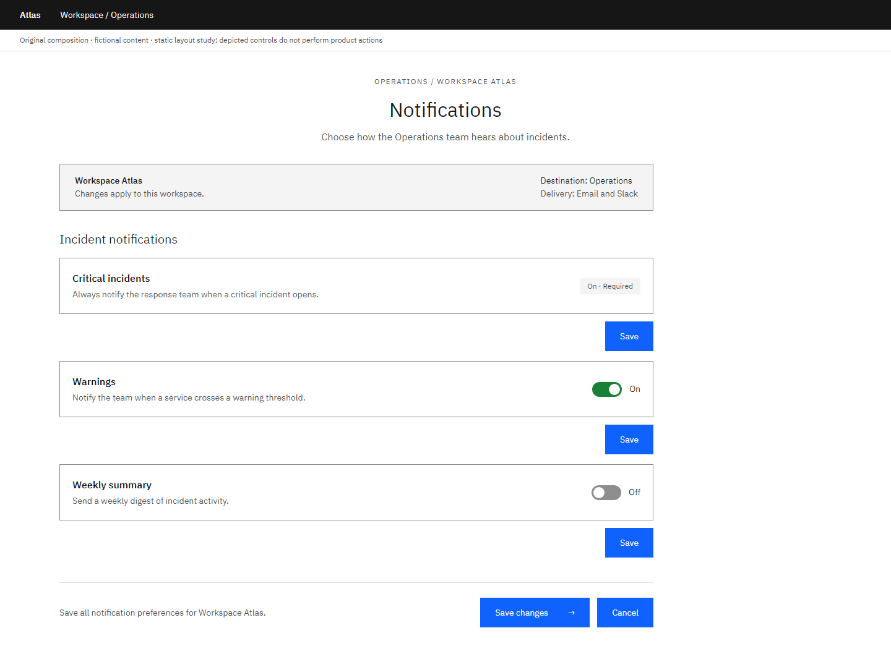
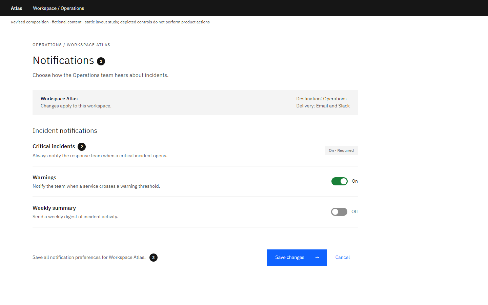

# Settings: Expose scope and save behavior

Author-created static composition study with fictional content. Local craft judgment; not an official IBM exemplar or a model-evaluation result.

**Task:** An operations lead adjusts incident notifications for one workspace without disabling required alerts.

**Original:** Repeated boxed sections and repeated Save labels make it difficult to infer which changes belong together.

**Revised:** Workspace scope appears first. Closely related preferences share a region, and one explicit save area describes the scope of the change.

## Decisions and conditions

### 1. Put the scope at the reading entry

The workspace name and delivery destination explain who is affected before the options. The page uses that same scope in its save summary.

**Tradeoff:** Scope controls can take valuable space on a very short preference page.

**Alternative:** A personal preference page can use concise account context; avoid unnecessary workspace chrome.

### 2. Distinguish required from editable

Critical incidents stay readable and are labeled Required. Optional warnings and summaries show their current states in words as well as visual controls.

**Tradeoff:** Static required settings are visible but cannot be adjusted here.

**Alternative:** When a value can be changed elsewhere, provide an explicit route and reason. Do not imitate an editable control if no edit is possible.

### 3. Make the persistence model coherent

A single save area represents a draft of related changes. Grouping and labels communicate the intended atomic update.

**Tradeoff:** A real implementation must retain a draft, expose unsaved changes and handle failed saves.

**Alternative:** Immediate-save toggles are valid for independent reversible preferences; show saving/failure feedback and remove the global Save button.

## Transfer exercise

Switch this page to immediate save. Identify every label, state and recovery behavior that must change—not just the button.

Compare a different task or constraint before applying these choices. The original versions deliberately expose composition problems; the revised versions are teaching proposals, not universally optimal designs.

Open the [viewer](../../assets/casebook/index.html) for both White and Gray 100, at 1440px and 390px. Screens use settings-before/after-white/g100-desktop/mobile.png. The mobile table intentionally scrolls within its own region.

## Source routes

- [Carbon forms](https://carbondesignsystem.com/patterns/forms-pattern/)

Sources inform general component, layout and type decisions. The task-specific comparisons and alternatives above are local heuristics. Static controls illustrate composition; they do not establish interaction, accessibility or Carbon React API correctness.
