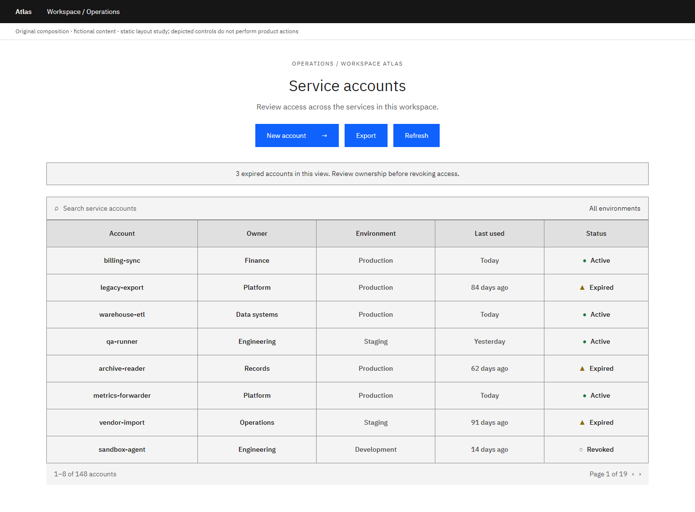
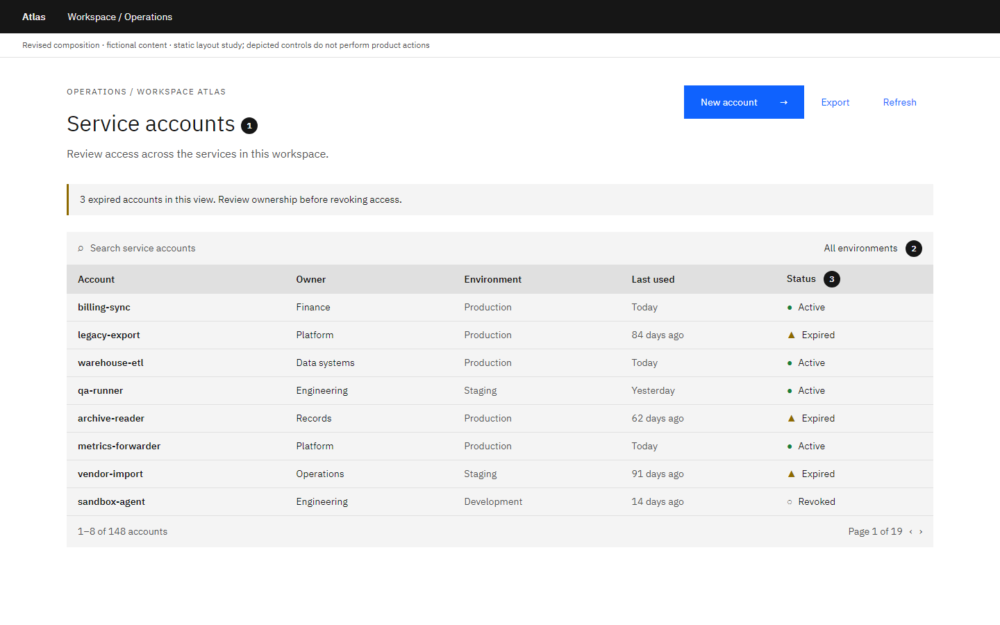

# Data table: Make the comparison easy

Author-created static composition study with fictional content. Local craft judgment; not an official IBM exemplar or a model-evaluation result.

**Task:** An administrator needs to identify expired service accounts and compare ownership before taking action.

**Original:** Strong borders, centered columns and equally prominent actions give every item the same weight.

**Revised:** A shared reading edge, restrained row boundaries and a task-specific summary make the records easier to compare.

## Decisions and conditions

### 1. Establish the task before the controls

The short expiry summary tells the administrator why this list needs attention. New account keeps primary emphasis; Export and Refresh remain available with less weight.

**Tradeoff:** A summary uses vertical space. Omit it when no reliable or useful status summary exists.

**Alternative:** For an audit workflow, put review or export emphasis first; creation need not dominate every table.

### 2. Align by the information being compared

Names and owners share left edges. Stable column positions let the eye compare rows without re-reading the structure. Font weight distinguishes identity from supporting detail.

**Tradeoff:** The table reserves width for comparison and scrolls locally on a narrow screen.

**Alternative:** Use a record list with disclosure when mobile reading of individual records matters more than cross-row comparison.

### 3. Use density deliberately

A 40px desktop row supports scanning this short text. Mobile rows grow to 48px. Text remains paired with the status marker, so the state does not depend on hue.

**Tradeoff:** Denser rows leave less room for descriptions and secondary actions.

**Alternative:** Choose a larger row size for multiline information; keep header and row heights coherent.

## Transfer exercise

The owner column now contains team names twice as long. Decide what wraps, what receives more width, and whether the page still needs all five columns.

Compare a different task or constraint before applying these choices. The original versions deliberately expose composition problems; the revised versions are teaching proposals, not universally optimal designs.

Open the [viewer](../../assets/casebook/index.html) for both White and Gray 100, at 1440px and 390px. Screens use table-before/after-white/g100-desktop/mobile.png. The mobile table intentionally scrolls within its own region.

## Source routes

- [Carbon data tables](https://carbondesignsystem.com/components/data-table/usage/)

Sources inform general component, layout and type decisions. The task-specific comparisons and alternatives above are local heuristics. Static controls illustrate composition; they do not establish interaction, accessibility or Carbon React API correctness.
